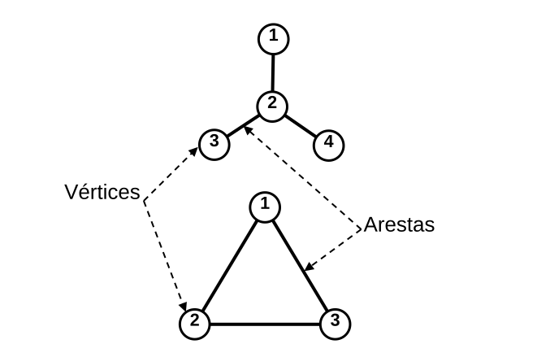
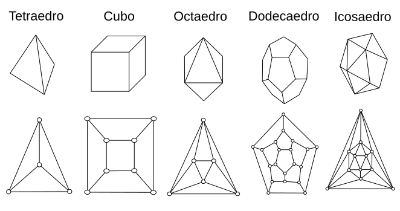
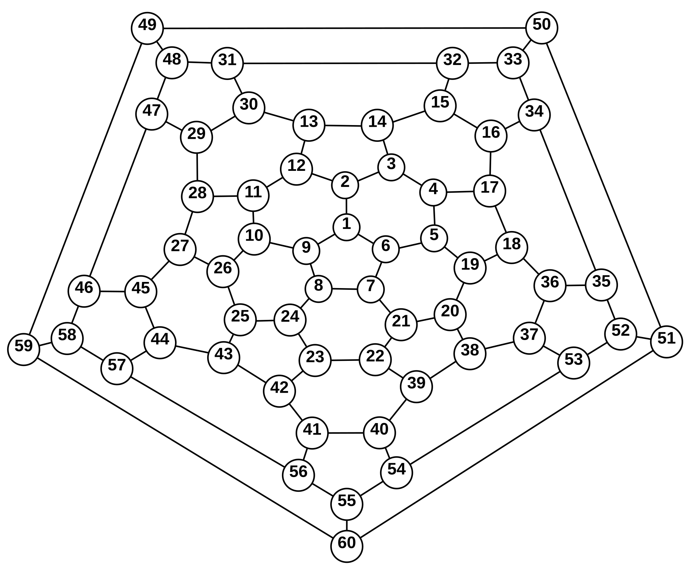
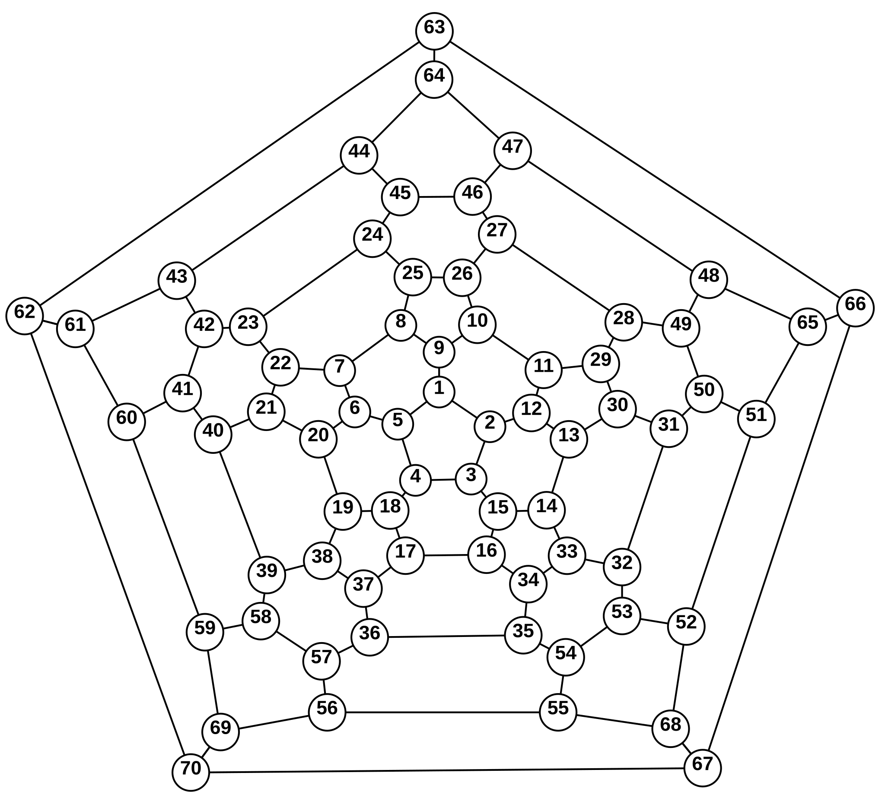

## Metodologia 

### Grafos e Matriz Laplaciana

:::: {.columns}
::: {.column  style="font-size:25px;"}

{#fig-grafos height=400px fig-align="center"}

- Elementos da Matriz Laplaciana $\mathbf{L}$

$$\small L_{ij} =\begin{cases}
		\;\;k_i, & i=j, \\
		-1,&\text{se } i \neq j \text{ e ocorrer ligação entre os vértices } i \text{ e } j ,\\
		\;\;\;0,& \text{caso contrário}.\end{cases}$$

Obs.: também pode ser chamada de Matriz Conectividade $\mathbf{A}$.
:::
::: {.column}

- Grafo Estrela 

$$\mathbf{L}=\begin{pmatrix}1&-1&0&0\\
-1&3&-1&-1\\
0&-1&1&0\\
0&-1&0&1\\\end{pmatrix}$$

- Espectro de autovalores

    $$L_{ij}\mathbf{w}_i=\lambda_i\mathbf{w}_i$$

    + $\lambda_i \in \mathbb{R}$ e segue a ordem $0=\lambda_1\leq\lambda_2\leq \dots\leq \lambda_{N}$

    + $\mathbf{w}_i$ é ortonormal
:::
::::

## Metodologia 

###  Diagramas de Schlegel

{#fig-poliedros height=300px  fig-align="center"}

- Fórmula de Euler para poliedros 
$$V-E+F=2$$
- Fulereno $C_n$
$$P=12, \quad H=\dfrac{n}{2}-10$$
    + $C_{60}$:  12 pentágonos e 20 hexágonos; $C_{70}$: 12 pentágonos e 25 hexágonos.

## Metodologia 

### Fulerenos

:::: {.columns}
::: {.column  style="text-align:center; font-size:25px;"}
 {#fig-C60 height=550px  fig-align="center"}

 Fonte: Adaptado de @Silantev2017.
:::
::: {.column  style="text-align:center; font-size:25px;"}
 {#fig-c70 height=550px  fig-align="center"}

 Fonte: Adaptado de @Silant.
:::
::::

## Metodologia 

### Folhas de grafeno

:::: {.columns}

::: {.column style="font-size:23px; text-align=left !important"}
{#fig-folhagrafeno height=550px  fig-align="center" }

:::
::: {.column style="font-size:23px;"}
- Primeira e última linha

$$2H_x+1$$

- Linhas interiores $(H_y>1)$

$$2H_x+2$$

- Total de vértices e arestas

$$N_G=2(H_x+H_y+H_xH_y)$$
$$E_G=N_G+H_xH_y-1$$
:::
::::

## Metodologia 

### Medidas de Probabilidade

:::: {.columns}

::: {.column style="font-size:23px; width=50%"}
- Probabilidade Média de Retorno
    + Clássico
$$\bar{p}(t)= \dfrac{1}{N}\sum_{n=1}^Ne^{- \lambda_n t}$$

    + Quântico
$$\; \bar{\pi}(t)=\frac{1}{N}\left|\sum_{n=1}^Ne^{-i\lambda_n t}\langle j|w_n\rangle\langle w_n|j\rangle\right|^2$$

- Probabilidade de Transição Quântica

$$\pi_{k,j}(t)=\left|\sum_{n=1}^Ne^{-i\lambda_n t}\langle k|w_n\rangle\langle w_n|j\rangle\right|^2$$

:::

::: {.column style="font-size:23px; width=50%"}

- No limite ao longo do tempo

$$\lim_{t\rightarrow \infty}\bar{p}(t)=\dfrac{1}{N}$$

- Valor Médio ao longo do tempo

$$\scriptsize\chi\equiv\dfrac{1}{N^2}\sum_{n=1}^N\sum_{m=1}^N\delta_{\lambda_n,\lambda_m}\leq\dfrac{1}{N}\sum_{j=1}^N\left[\sum_{n=1}^N\sum_{m=1}^N\delta_{\lambda_n,\lambda_m}|\langle w_n|j\rangle|^2|\langle w_m|j\rangle|^2\right]\equiv\bar{\chi}$$

$$\begin{aligned}\blacktriangleright\;\chi,\bar{\chi }=0\rightarrow\text{ O tranporte é eficiente} \;\;\\ \blacktriangleright\;\chi,\bar{\chi }=1\rightarrow\text{O tranporte é  ineficiente}\end{aligned}$$

:::

::::

