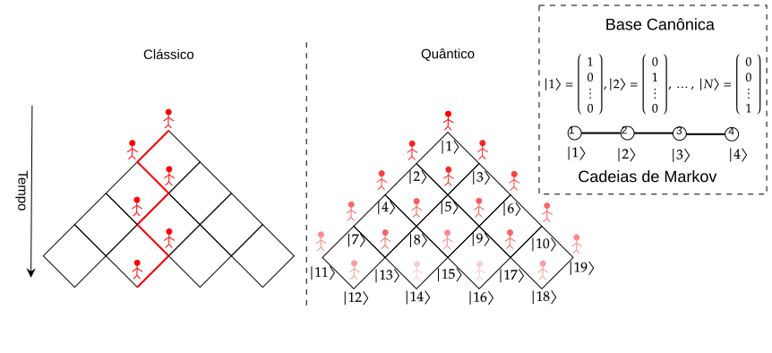

## Introdução
{height=750px fig-align="center"}

## Introdução
### Modelo de Caminhadas
{height=450px fig-align="center"}

#### Caminhadas Quânticas

:::: {.columns}
::: {.column}

- Tempo Discreto 
    + @Aharonov_1993
    + Espaço moeda e Espaço posição
:::
::: {.column}

- Tempo Contínuo
    + @Farhi_1998
    + $U(t)=e^{-i\mathbf{H}t}$

:::
:::: 

## Introdução
### Objetivo

- Avaliar a eficiência do transporte quântico nas redes de grafeno e fulereno.
    + Determinar as probabilidades médias de retorno clássico e quântico.
    + Deterninar a probabiladade de transição quântica e o valor médio ao longo do tempo.
    + Identificar as estruturas que possuem o melhor e pior eficiência do transporte.

