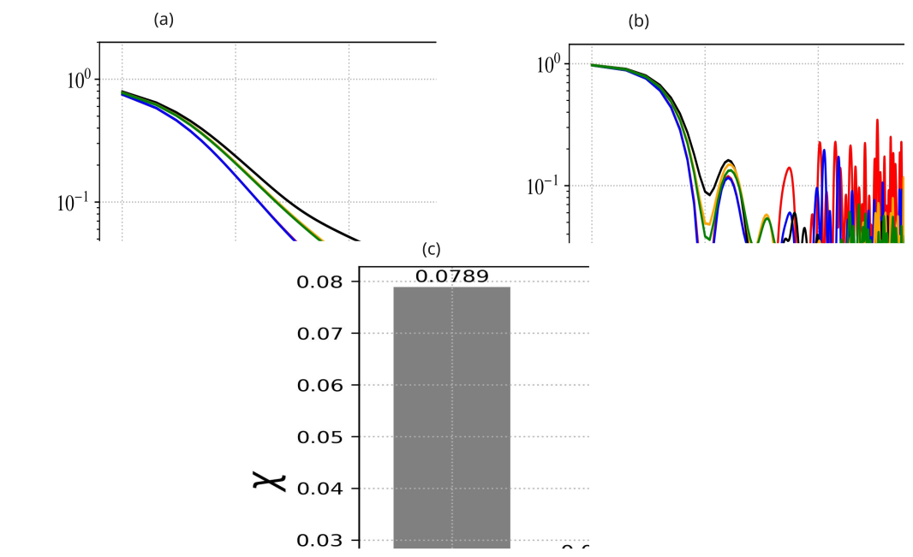
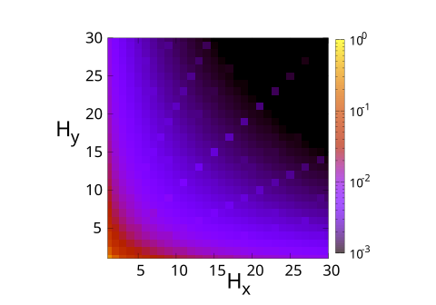

## Resultados

### Probabilidade Média de Retorno e Eficiência

{#fig-C60 height=700px  fig-align="center"}

## Resultados

### Variando $H_x$ e $H_y$

{#fig-grafos height=300px fig-align="center"}

:::: {.columns}
::: {.column  style="font-size:25px;"}

- Eficientes
    + (1,$H_y$) predominantemente *Armchair*.
    + ($H_x$,i) para $i>1$ fixo.
:::

::: {.column  style="font-size:25px;"}

- Ineficiente 

    + $H_x=H_y$ para valores ímpares $H_x(H_x>7)$.
    + ($H_x,H_y=2H_x+1$).
    + ($H_x=2H_x+1,H_y$).

:::
::::

## Resultados

### Probabilidade de Transição Quântica

::: {#fig-graficostransicao layout-ncol=5}

{#fig-graficoc60}

{#fig-graficoc70}

{#fig-grafeno_hx17}

{#fig-grafeno_hx8}

{#fig-grafeno_hx5}

Gráficos de contorno da probabilidade de transição $\pi_{k,j} (10)$.
:::

:::{.panel-tabset}

### Análise

:::: {.columns}
::: {.column  style="font-size:25px;"}
- Fulereno $C_{60}$
    + Probabilidade alta em nós diametralmente opostos 2 e 55: $2\rightarrow 1 \rightarrow 6 \rightarrow 7\rightarrow  21 \rightarrow 22 \rightarrow 39 \rightarrow 40 \rightarrow 54\rightarrow 55$

- Fulereno $C_{70}$
    + Probabilidade alta em $2\rightarrow 12\rightarrow 13\rightarrow 30\rightarrow 31\rightarrow 50\rightarrow 51\rightarrow 65\rightarrow 66$
    + Centros de difusão quântica em nós: 23,24,27,28,31,32,35,36,39,40

:::
::: {.column  style="font-size:25px;"}
:::
::::
### Fulereno

{ height=300px fig-align="center"}

### Grafeno

{ height=300px fig-align="center"}

:::